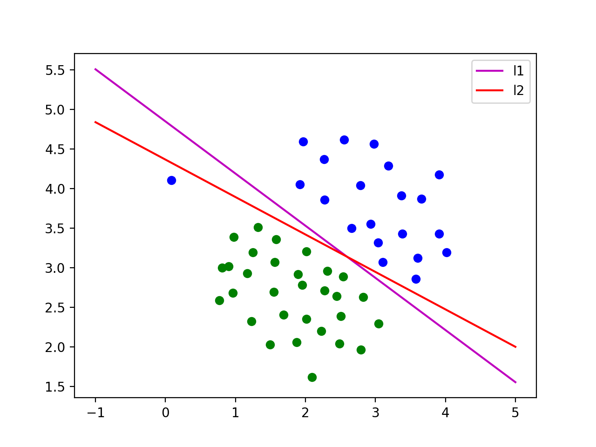

# Support Vector Machine L1 and L2 regulazation and Customized Kernel.
A quick tutorial of SVM and implementation of SVM.

<html>
  <h1>This is heading 1</h1>

  <body>
    
SVM is solving a problem like "How can I pick a threshold (drawing a line) among the data to classify differnt data?"

    
   
    
   
    For example, in the graph shown above, we are considering draw a decision boundary between the green data and the blue data. As we can see, both red line and the pink line seperates the data. As we finish the job, we now considering which one of the line is better? the red one or the pink one? Is there any optimal solution for spliting the data?

    
   
    This leads us to the essential question of SVM.

    
  </body>
  
